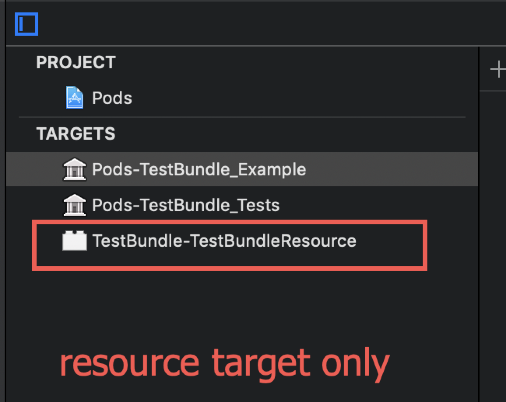
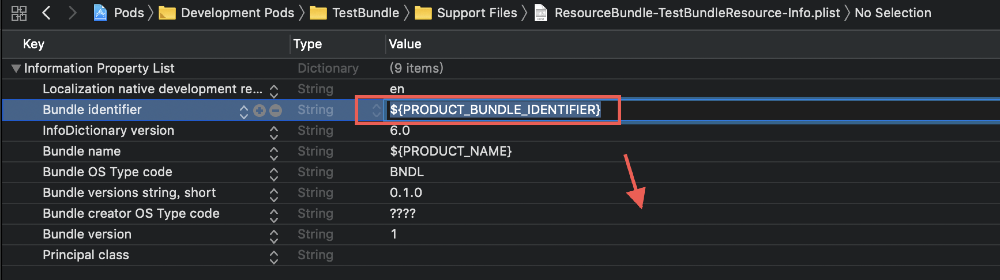

# TestBundle

[](https://travis-ci.org/lizhuoli1126@126.com/TestBundle)
[](https://cocoapods.org/pods/TestBundle)
[](https://cocoapods.org/pods/TestBundle)
[](https://cocoapods.org/pods/TestBundle)

## What's for

There seems a CocoaPods (from 1.4.0-1.5.3) issue, which will cause the `resource_bundle` generated bundle identifier missing and become invalid.

The key point to trigger this issue is to make your Pods does not generate a Xcode compile unit target, but only generate a resource target. Like this:




Because the generated resource target using the ENV value `PRODUCT_BUNDLE_IDENTIFIER` inside the `Info.plist`, which will be evaluated as empty and then cause the issue.



## Example

To run the example project, clone the repo, and run `pod install` from the Example directory first.

## Requirements

## Installation

TestBundle is available through [CocoaPods](https://cocoapods.org). To install
it, simply add the following line to your Podfile:

```ruby
pod 'TestBundle'
```

## Author

lizhuoli1126@126.com, lizhuoli1126@126.com

## License

TestBundle is available under the MIT license. See the LICENSE file for more info.


